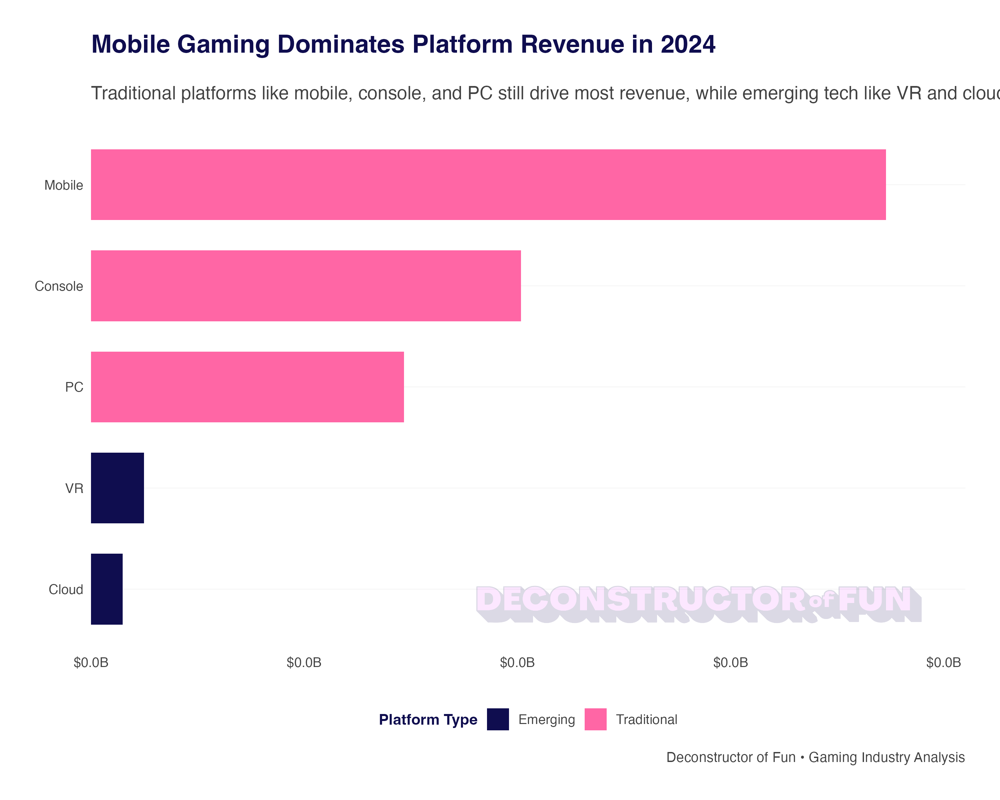

# Deconstructor of Fun ggplot2 & GT Themes

Professional R themes for the Deconstructor of Fun podcast with branded colors, fonts, and chart containers.



## Quick Start

```r
# Load themes
source("dof_theme.R")
source("dof_gt_theme.R")

# Create branded ggplot2 chart with pink border and logo strip
your_plot + theme_dof() %>%
  create_dof_container(logo_color = "primary", icon_color = "primary")

# Create branded GT table with optional border
your_table %>% theme_dof_gt(container_border = TRUE)
```

## Example Code

The chart above was generated with:

```r
# Load the DoF theme
source("dof_theme.R")

# Create sample data
gaming_data <- data.frame(
  platform = c("Mobile", "Console", "PC", "VR", "Cloud"),
  revenue_billions = c(93.2, 50.4, 36.7, 6.2, 3.7),
  category = c("Traditional", "Traditional", "Traditional", "Emerging", "Emerging")
)

# Create the plot
p <- ggplot(gaming_data, aes(x = reorder(platform, revenue_billions), y = revenue_billions)) +
  geom_col(aes(fill = category), width = 0.7) +
  scale_fill_dof("purple_pink") +
  scale_y_continuous(labels = format_dof_billions, expand = c(0, 0, 0.1, 0)) +
  coord_flip() +
  labs(
    title = "MOBILE GAMING DOMINATES PLATFORM REVENUE IN 2024",
    subtitle = "Traditional platforms like mobile, console, and PC still drive most revenue,\nwhile emerging tech like VR and cloud gaming remain small",
    fill = "Platform Type"
  ) +
  theme_dof()

# Add DoF container with pink border and logo strip
result <- create_dof_container(p, width = 1200, height = 800)
```

## Logo Color Options

Customize logo and icon colors:

```r
create_dof_container(
  plot, 
  logo_color = "black",     # "primary", "secondary", "black", "white"
  icon_color = "white"      # "primary", "secondary", "black", "white"
)
```

## Brand Colors

- **Primary**: #FF66A5 (Galactic Magenta)
- **Secondary**: #0F0D4F (Midnight Indigo) 
- **Accent**: #4F00EB (Pac(Man) Purple)

## Installation

```r
# Install required packages
install.packages(c("ggplot2", "gt", "magick", "scales", "dplyr"))

# Clone or download this repository
# Source the theme files in your R script
```

## Running Examples

```bash
cd examples
Rscript run_all_examples.R
```

Outputs saved to `examples/output/`:
- `example_chart.png` - Branded ggplot2 chart
- `example_table.png` - Branded GT table