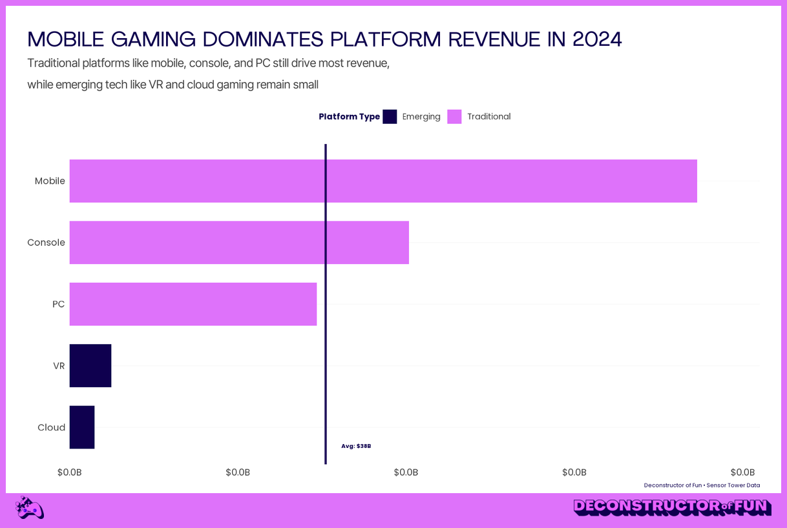

# Deconstructor of Fun ggplot2 & GT Themes

Professional R visualization themes for the Deconstructor of Fun podcast, featuring custom colors, typography, and branded chart containers.



## Features

- **538-style charts** with bold uppercase titles and clean aesthetics
- **Smart axis formatting** that automatically scales values (e.g., $1.2M, $3.5B)
- **Branded containers** with customizable pink borders and logo strips
- **GT table themes** with matching typography and colors
- **Multiple chart types** including stacked bars, lines with smoothing, and more

## Installation

### Option 1: One-Line Installation (with web fonts fallback)

```r
# Source the ggplot and GT theme files
source("https://raw.githubusercontent.com/econosopher/dof_theme/main/dof_theme.R")
source("https://raw.githubusercontent.com/econosopher/dof_theme/main/dof_gt_theme.R")
```

### Option 2: Clone Repository

```r
# Clone this repository
git clone https://github.com/econosopher/dof_theme.git

# Install required packages
install.packages(c("ggplot2", "gt", "magick", "scales", "dplyr", "showtext", "sysfonts", "base64enc"))

# Source the theme files
source("dof_theme.R")
source("dof_gt_theme.R")
```

### Option 3: Direct Sourcing

```r
# Source ggplot2 and GT themes (requires local fonts and packages)
source("https://raw.githubusercontent.com/econosopher/dof_theme/main/dof_theme.R")
source("https://raw.githubusercontent.com/econosopher/dof_theme/main/dof_gt_theme.R")
```

## Quick Start

### Basic Chart with DoF Theme

```r
# Create a simple bar chart (strip can be set to "accent" for purple)
library(ggplot2)
source("dof_theme.R")

# Your data
data <- data.frame(
  category = c("Mobile", "Console", "PC"),
  value = c(93.2, 50.4, 36.7)
)

# Create plot with DoF theme
p <- ggplot(data, aes(x = category, y = value)) +
  geom_col(fill = dof_colors$primary) +
  scale_y_continuous(labels = format_dof_smart_currency) +
  labs(title = "GAMING REVENUE BY PLATFORM") +
  theme_dof()

# Add branded container with border and purple strip
create_dof_container(p, strip_color = "accent")
```

### GT Table with DoF Theme

```r
library(gt)
library(dplyr)
source("dof_gt_theme.R")

# Create and style a table
mtcars %>%
  head() %>%
  gt() %>%
  theme_dof_gt(container_border = TRUE)
```

## Customization Options

### Container Borders and Logos

```r
create_dof_container(
  plot,
  logo_strip = TRUE,              # Add logo strip at bottom
  logo_color = "primary",         # Logo color: "primary", "secondary", "black", "white"
  icon_color = "primary",         # Icon color options
  container_border = TRUE,        # Add pink border
  border_width = 9,               # Border thickness in pixels
  strip_height_px = 45,           # Logo strip height
  strip_position = "bottom",      # New: place strip at top or bottom
  y_nudge = 0,                    # New: fine-tune vertical alignment of logos
  fallback_text = NULL,           # New: text used if logos are missing
  # QR code options
  qr_path = NULL,                 # Provide a PNG of a QR code (recommended)
  qr_link = NULL,                 # Or a URL to encode (requires 'qrcode' + 'png')
  qr_size = 36,                   # Square QR size in px
  qr_margin = 15                  # Right margin for QR in px
)
```

### Color Palettes

```r
# Available color palettes
scale_fill_dof("main")         # Primary colors
scale_fill_dof("purple_pink")  # Purple to pink gradient
scale_fill_dof("full")         # All brand colors

# Access individual colors
dof_colors$primary    # #DE72FA (Galactic Magenta)
dof_colors$secondary  # #0F004F (Midnight Indigo)
dof_colors$accent     # #4F00EB (Pac(Man) Purple)
```

### Smart Number Formatting

```r
# Automatic formatting based on value size
format_dof_smart_currency(1234)      # $1.23K
format_dof_smart_currency(1234567)   # $1.2M
format_dof_smart_currency(0.28)      # $0.28 (2 decimals for <$100)

# Specific formatters
format_dof_millions()   # Force millions format
format_dof_billions()   # Force billions format
format_dof_percent()    # Percentage format
```

## Advanced Examples

### 100% Stacked Bar Chart with Labels

```r
# Data with percentages
data <- data.frame(
  platform = rep(c("Mobile", "Console", "PC"), each = 3),
  model = rep(c("F2P", "Premium", "Subscription"), 3),
  percentage = c(65, 25, 10, 20, 70, 10, 35, 55, 10)
)

# Create chart with labels inside bars
ggplot(data, aes(x = platform, y = percentage, fill = model)) +
  geom_col(position = "fill") +
  geom_text(aes(label = paste0(percentage, "%")), 
            position = position_fill(vjust = 0.5),
            color = "white", fontface = "bold") +
  scale_y_continuous(labels = percent_format()) +
  scale_fill_dof("full") +
  labs(title = "MONETIZATION MODELS BY PLATFORM") +
  theme_dof() %>%
  create_dof_container()
```

### Line Chart with Smoothing

```r
# Time series data
dates <- seq.Date(Sys.Date() - 30, Sys.Date(), by = "day")
values <- cumsum(rnorm(31, mean = 1000, sd = 200))

data <- data.frame(date = dates, revenue = values)

# Create smoothed line chart
ggplot(data, aes(x = date, y = revenue)) +
  geom_smooth(method = "loess", se = FALSE, color = dof_colors$primary) +
  geom_point(size = 2, color = dof_colors$secondary) +
  scale_y_continuous(labels = format_dof_smart_currency) +
  labs(title = "30-DAY REVENUE TREND") +
  theme_dof() %>%
  create_dof_container()
```

## Brand Guidelines

### Colors
- **Primary**: #DE72FA (Galactic Magenta) - Used for emphasis and borders
- **Secondary**: #0F004F (Midnight Indigo) - Text and dark elements
- **Accent**: #4F00EB (Pac(Man) Purple) - Highlights and accents

### Typography
- **Titles**: Bold, uppercase for 538-style impact
- **Subtitles**: Regular weight, sentence case
- **Data**: Clean, minimal axis labels

### Layout
- Left-aligned titles and subtitles
- Minimal grid lines (horizontal only)
- No axis titles (538 style)
- Pink container border (9px)
- Logo strip at bottom (45px)

### Logo assets note

- If you source the theme files directly from GitHub, logo image assets are not downloaded.
- Either clone the repo (assets live under `assets/brand/...`) or pass explicit paths via `logo_path`/`icon_path`.
- The theme now searches both the working directory and the theme’s own directory, so cloned repos work from anywhere.
- If logos aren’t available, you can set `fallback_text = "Deconstructor of Fun"` to render branded text in the strip.

## Examples Gallery

Run all examples to see the full range of charts:

```bash
cd examples
Rscript run_all_examples.R
```

This generates:
- `example_bar_chart.png` - Basic bar chart
- `example_line_chart.png` - Line chart with smoothing
- `example_stacked_bar_chart.png` - Stacked bars
- `example_100_stacked_bar_chart.png` - 100% stacked with labels
- `example_table.png` - GT table example

## Contributing

Feel free to submit issues or pull requests to improve the themes.

## License

This project is available for use under the MIT License.
